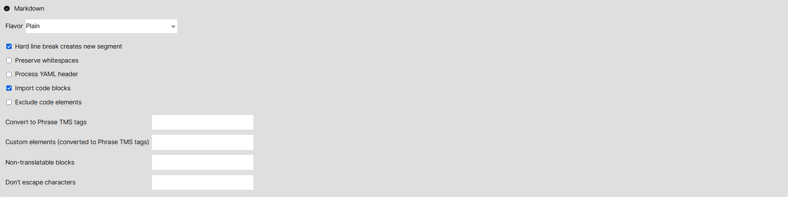

Phrase
===

# How to open Markdown settings in Phrase

1. Create a new project.
2. Create a job.
3. Add a Markdown file.
4. In the file import settings, scroll down to Markdown.
5. Click the `Markdown` button to open the Markdown settings as seen in the image below.

*Figure 1: Default Markdown filters in Phrase*

# Markdown settings

Phrase has the following filter settings for Markdown:
1. `Flavor` (only one can be selected):
	- `Plain`
	- `PHP/Python Markdown Extra`
	- `GitHub Flavored Markdown`
2. `Hard line break creates new segment` (default)
3. `Preserve whitespaces`
4. `Process YAML header` (not covered — the test file does not include a YAML header)
5. `Import code blocks` (default)
6. `Exclude code elements`
7. `Convert to Phrase TMS tags` (uses regex; requires a list of items)
8. `Custom elements (converted to Phrase TMS tags)` (requires a list of items)
9. `Non-translatable blocks` (requires a list of items)
10. `Don't escape characters` (requires a list of items)

The settings that require a list of items are not covered in this project. The reason is that there are many options and fringe cases that a user may want to configure. This is beyond the scope of the project. The project focuses only on the filters already configured in the software.

The default settings were used as the basic settings in the study. First, the Markdown flavours were checked. Then, further settings were added in the order from top to bottom.

The behaviour of the settings is described in the [Phrase — results](phrase-02-results) section.

---

Go to section: [*Phrase — results*](phrase-02-results)

---