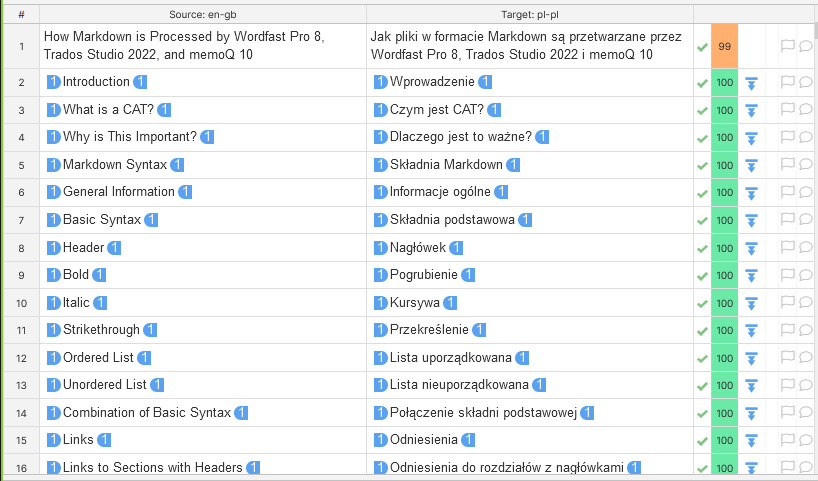
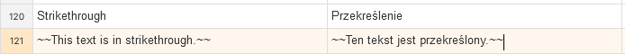
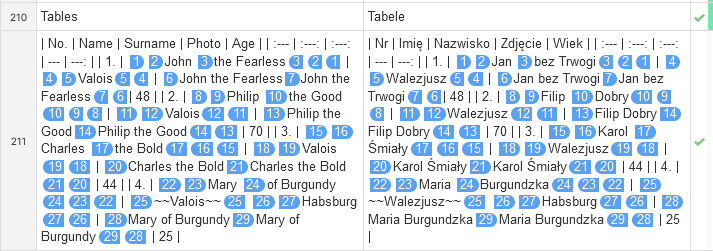

Phrase
===

# Phrase results

<!-- REUSE COMP BGN -->
The results for individual settings are grouped according to the sections in the test file. If a feature is not mentioned, it means it works as intended — it was imported correctly into the editor and produced correct output in the exported file.

The test was carried out by checking the boxes in the settings. This made the CAT import more features and allowed more editing. When a feature started working, it is noted in the relevant section.

The links in the headers lead to the files translated with given settings.

**IMPORTANT**: Not every Markdown formatting, e.g., `^superscript^`, works in GitHub preview. The fact that a feature does not work in GitHub preview does not mean it is caused by the incorrect output from the CAT. Various flavours ("dialects") of Markdown render more sophisticated syntax differently on different platforms.

**NOTE**:
The meanings of several phrases used in this section can be found in [Definitions](ref-test-file#definitions).
The reference information on what should or should not be translated (e.g. inline code) can be found in the section [*Why is Markdown difficult for CATs?**](ref-why-md-difficult).
<!-- REUSE COMP END -->

# General results

The Phrase editor shows the majority of Markdown formatting as CAT tags:



*Figure 1: CAT tags in Phrase*

Links to websites are ignored and not shown as CAT tags. However, the alt text for URLs is shown as CAT tags.

There is often a discrepancy between what is seen in the editor and what actually works or does not work in the output file.

# [Plain](resources/Markdown-in-CAT-test-PH_PL-01){:target="_blank"}

## Basic syntax

<kbd>&#128680;REALLY!</kbd>: Strikethrough is shown as text:



*Figure 2: Strikethrough shown as text*

<kbd>&#128228;OUPUT FILE ISSUE</kbd>: Ordered lists do not work. Backslash is entered in the output file which turns off the list:

```
Oto przykład listy uporządkowanej: 1\. Pozycja 1 2. Pozycja 2 3. Pozycja 3 1. Podpozycja 3.1 2. Podpozycja 3.2.
```

<kbd>&#128228;OUPUT FILE ISSUE</kbd>: Unordered lists do not work in the output file:

```
Oto przykład listy nieuporządkowanej: - Pozycja 1 - Pozycja 2 - Pozycja 3 - Podpozycja 3 - Podpozycja 3
```

The rest works as intended.

## Links

Reference is not fully translatable: the display text in square brackets is translatable, but the reference content in round brackets is not translatable as in `[Składnia podstawowa](#basic-syntax)`.

URLs are shown as text.

The rest works as intended.

## Quotations

Code block is shown as text.

<kbd>&#128228;OUPUT FILE ISSUE</kbd>: The escape sign `\` was inserted in front of every backtick {\`} symbol in the output file — code block does not work in the output.

```
Składnia: \`\`\`
# Nagłówek 1
## Nagłówek 2
### Nagłówek 3
\`\`\`
```

Inline code works and its content can be translated.

The rest works as intended or as above.

## Extended syntax

Table syntax is shown as text:


*Figure 3: Table syntax in Phrase editor. Note that remaining Markdown syntax is shown as CAT tags*

<kbd>&#128228;OUPUT FILE ISSUE</kbd>: The table does not work in the output file.

The task list does not work in the output file because it uses the syntax of an unordered list.

Emoji is shown as text.

<kbd>&#128680;REALLY!</kbd>: Despite of the various issues mentioned above, it is surprising that emoji works in the output file.

Comments to be omitted are ignored.

The rest works as intended.

## HTML and other tags

<kbd>&#128228;OUPUT FILE ISSUE</kbd>: The Markdown table in the collapsed section does not work.

<kbd>&#128680;REALLY!</kbd>: However, other Markdown formatting works in the collapsed section.

HTML is shown as text. Otherwise, it works as intended in the output file

<kbd>&#128228;OUPUT FILE ISSUE</kbd>: Because code block does not work, the embedded HTML is shown twice in the output file.

The rest works as intended.

# [PHP/Python Markdown extra](resources/Markdown-in-CAT-test-PH_PL-02){:target="_blank"}

## Basic syntax

Basic syntax works as intended or as above.

<kbd>&#128680;REALLY!</kbd>: Indeed, lists do not work here either.

## Links

The links work as intended or as above.

## Quotations

Code blocks work as intended and it can be translated. All Markdown, HTML, and JavaScript code is shown as text.

The rest works as intended or as above.

## Extended syntax

Tables work as intended.

Footnotes work as intended.

The rest works as intended or as above.

## HTML and other tags

HTML and other tags work as intended or as above.

# [GitHub flavoured Markdown](resources/Markdown-in-CAT-test-PH_PL-03){:target="_blank"}

## Basic syntax

Ordered lists work as intended.

Unordered lists work as intended.

The rest works as intended.

## Links

The links work as intended or as above.

## Quotations

Quotations work as intended or as above.

## Extended syntax

Footnotes do not work.

The rest works as intended or as above.

## HTML and other tags

The Markdown table works in the collapsed section.

HTML and other tags work as intended or as above.

**IMPORTANT:** This flavour setting works best out of the three, so it will be used in further study.

# [Preserve whitespaces](resources/Markdown-in-CAT-test-PH_PL-04){:target="_blank"}

Generally, the segmentation changed, but the output file is similar to the one in the [GitHub flavoured Markdown](#github-flavoured-markdown) setting.

As a result, no detailed study is presented.

# [Exclude code elements](resources/Markdown-in-CAT-test-PH_PL-05){:target="_blank"}

Generally, this setting works similarly to [GitHub flavoured Markdown](#github-flavoured-markdown) with one exception.

Inline code is ignored.

As a result, no detailed study is presented.

# [Exclude code elements with unchecked import code blocks](resources/Markdown-in-CAT-test-PH_PL-06){:target="_blank"}

Generally, this setting works similarly to [Exclude code elements](#exclude-code-elements) with one exception.

Block code is ignored.

As a result, no detailed study is presented.

---

Go to section: [*Phrase — summary and recommendations*](phrase-03-summary-and-recommendations)