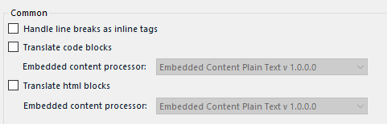

Trados Studio 2022
===

# How to open Markdown settings in Trados Studio 2022

1. Create a new project.
2. Go to `Project settings`.
3. In the list on the left, click on the triangle to the left of `File types` to unroll the list.
4. Scroll down to `Markdown`.
5. Click on the triangle to the left of `Markdown` to unroll the list.
6. Click `Common` to open Markdown settings as seen in the image below.

*Figure 1: default Markdown filters in Trados Studio 2022*

# Markdown settings

Trados Studio 2022 has the following filter settings for Markdown:
1. `Handle line breaks as inline tags`
2. `Translate code blocks` with the following embedded content processors (only one can be selected):
	1. `Embedded Content Plain Text v 1.0.0.0`
	2. `Embedded Content SpreadsheetML v. 1`
	3. `Html Embedded Content 5 2.0.0.0`
3. `Translate html blocks` with the following embedded content processors (only one can be selected):
	1. `Embedded Content Plain Text v 1.0.0.0`
	2. `Embedded Content SpreadsheetML v. 1`
	3. `Html Embedded Content 5 2.0.0.0`

All of these are unchecked in default settings.

The default settings were used as the basic settings in the study. Then, further settings were added in the order from top to bottom. The embedded content processors were tested one by one.

The behaviour of the settings is described in the [Trados Studio 2022 — results](trados-02-results) section.

---

Go to section: [*Trados Studio 2022 — results*](trados-02-results) 

---