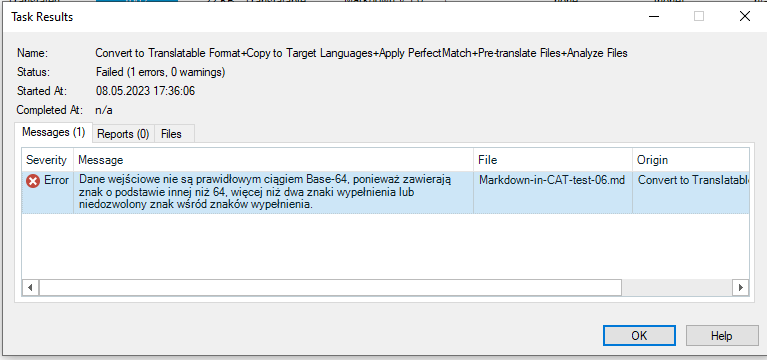

Trados Studio 2022
===

# Trados results

<!-- REUSE COMP BGN -->
The results for individual settings are grouped according to the sections in the test file. If a feature is not mentioned, it means it works as intended — it was imported correctly into the editor and produced the correct output in the exported file.

The test was carried out by checking the boxes in the settings. This made the CAT import more features and allowed more editing. When a feature starts working, it is noted in the relevant section.

The links in the headers lead to the files translated with the given settings.

{: .important }
Not every Markdown formatting, e.g., `^superscript^`, works in GitHub preview. The fact that a feature does not work in GitHub preview does not mean it is caused by the incorrect output from the CAT. Various flavours ("dialects") of Markdown render more sophisticated syntax differently on different platforms.

{: .note }
The meanings of several phrases used in this section can be found in [Definitions](ref-test-file#definitions).
The reference information on what should or should not be translated (e.g. inline code) can be found in the section [*Why is Markdown difficult for CATs?*](ref-why-md-difficult).
<!-- REUSE COMP END -->

<details>
<summary>Table of contents:</summary>

- [General results](#general-results)
- [Default settings{:target="\_blank"}](#default-settingstarget_blank)
- [Handle line breaks as inline tags{:target="\_blank"}](#handle-line-breaks-as-inline-tagstarget_blank)
- [Translate code blocks with embedded content plain text v 1.0.0.0{:target="\_blank"}](#translate-code-blocks-with-embedded-content-plain-text-v-1000target_blank)
- [Translate code blocks with embedded content spreadsheetML v. 1](#translate-code-blocks-with-embedded-content-spreadsheetml-v-1)
- [Translate code blocks with HTML embedded content 5 2.0.0.0{:target="\_blank"}](#translate-code-blocks-with-html-embedded-content-5-2000target_blank)
- [Translate HTML blocks with embedded content plain text v 1.0.0.0{:target="\_blank"}](#translate-html-blocks-with-embedded-content-plain-text-v-1000target_blank)
- [Results](#results)
- [Translate HTML blocks with embedded content spreadsheetML v. 1](#translate-html-blocks-with-embedded-content-spreadsheetml-v-1)
- [Translate HTML blocks with HTML embedded content 5 2.0.0.0{:target="\_blank"}](#translate-html-blocks-with-html-embedded-content-5-2000target_blank)

</details>

# General results

Trados sometimes does not display CAT tags for bold, italics, or strikethrough, but shows formatted text in the editor.


*Figure 1: Trados editor with formatted text without CAT tags*


*Figure 2: Trados editor with formatted text with CAT tags*

The view in Figure 2 is most likely caused by combination of several types of formatting.

Trados does not ignore non-editable elements, such as URLs, but inserts them as CAT tags.

<kbd>&#128008;CAT EDITOR ISSUE</kbd>:  Trados displaces hover text and changes it between links:

```
Source:
233 | [](http://www.youtube.com/watch?v=MRRmU_pOXnk "I am what I play").
...
239 | 1. The link to section on [**Bold** with a hover text is here](#bold "Bolder").

Output:
233 | [](http://www.youtube.com/watch?v=MRRmU_pOXnk "Jestem DJ-em").
...
239 | 1. Odniesienie do rozdziału [**Pogrubienie** z tekstem podpisu znajduje się tutaj](#bold "Jestem tym, co gram").
```

As can be seen, the translated alt text `I am a DJ` (in Polish `Jestem DJ-em`) from line 233 of the source file is moved to hover text.

The translated hover text `I am what I play` (in Polish `Jestem tym, co gram`) from line 233 is moved to hover text in line 239.

The links in the headers lead to output files — the files translated with given settings.

# [Default settings](resources/Markdown-in-CAT-test-TS_PL-01){:target="_blank"}

## Basic syntax

Basic syntax works as intended.

## Links

Reference is not fully translatable: the display text in square brackets is translatable, but the reference content in round brackets is not translatable as in `[Składnia podstawowa](#basic-syntax)`.

## Quotations

Inline code is shown as a CAT tag.

Block code is shown as a CAT tag.

Block code with JavaScript comment is shown as a CAT tag.

## Extended syntax

Emoji is ignored, but it is shown correctly in the output file.

Footnotes do not work in the output file.

Comments to be omitted are ignored.

## HTML and other tags

Generally, HTML tags with their content are either ignored or shown as CAT tags.

Text between `<code></code>` HTML tags can be translated. It was expected that it would be ignored just like inline code or code block.

<kbd>&#128680;REALLY!</kbd>: The inline code does not turn off HTML in one place, but it did in another:


*Figure 3: Back tick does not work with `<p>Lorem ipsum</p>`, but it does with `<p></p>`*

The text in `<summary>Unroll another section</summary>` is ignored. However, the rest of the content between the `<details></details>` tags is imported.

Keyboard keys work as intended.

Definition is ignored.

The content of the embedded HTML section is ignored.

# [Handle line breaks as inline tags](resources/Markdown-in-CAT-test-TS_PL-02){:target="_blank"}

This setting works like [default settings](#default-settings), only segmentation changed. As a result, further analysis is omitted.

# [Translate code blocks with embedded content plain text v 1.0.0.0](resources/Markdown-in-CAT-test-TS_PL-03){:target="_blank"}

## Basic syntax

Basic syntax works as intended.

## Links

The links work as intended or as above.

## Quotations

Content of the code block can be translated.

The tags are shown as text.

The comment in JavaScript in the code block can be translated.

The whole Java script is shown as text.

The rest works as above.

## Extended syntax

Extended syntax works as intended or as above.

## HTML and other tags

HTML and other tags work as intended or as above.

<kbd>&#128680;REALLY!</kbd>: Because the HTML is still not imported but the content of the code block is, the content of the embedded HTML code is translated only in the code block.

# Translate code blocks with embedded content spreadsheetML v. 1

<kbd>&#128008;CAT EDITOR ISSUE</kbd>: This setting generates the following error.


*Figure 3: Import error in Trados — SpreadsheetML v. 1*

After trial and error, it was discovered that error is caused by backtick <code>`</code>. As a result, no study was carried out for that setting.

# [Translate code blocks with HTML embedded content 5 2.0.0.0](resources/Markdown-in-CAT-test-TS_PL-04){:target="_blank"}

<kbd>&#128008;CAT EDITOR ISSUE</kbd>: This setting generates the following error.


*Figure 4: Import error in Trados — HTML embedded content 5 2.0.0.0*

After trial and error, it was discovered that JavaScript code block generates the error. The JavaScript was removed to open the test file.

<kbd>&#128228;OUTPUT FILE ISSUE</kbd>: The quotation marks in the code block for "Definition" are shown as `&bdquo;` in the output file.

Apart from that, the text differs in segmentation, but the general behaviour stays as in [Translate code blocks with embedded content plain text v 1.0.0.0](#Translate-code-blocks-embedded-content-plain-text-v-1.0.0.0).

As a result, no further study is carried out.

# [Translate HTML blocks with embedded content plain text v 1.0.0.0](resources/Markdown-in-CAT-test-TS_PL-05){:target="_blank"}

It is used in combination with [Translate code blocks with embedded content plain text v 1.0.0.0](#Translate-code-blocks-embedded-content-plain-text-v-1.0.0.0) because this gave the least number of errors.

# Results

## Basic syntax

Basic syntax works as intended.

## Links

The links work as intended or as above.

## Quotations

Quotations work as intended or as above.

## Extended syntax

Comment `<!-- comment example -->` is imported and can be edited, but not `<!-- omit in toc -->`

The rest works as intended or as above.

## HTML and other tags

Embedded HTML is imported and can be translated. 

<kbd>&#128680;REALLY!</kbd>: However, HTML is shown as text — the whole HTML code with all its tags.

# Translate HTML blocks with embedded content spreadsheetML v. 1

This setting generates the following error:



*Figure 5: Import error in Trados — embedded content spreadsheetML v. 1*

<kbd>&#128680;REALLY!</kbd>: The error is caused by the `<` symbol.

As a result, no study was carried out for that setting.

# [Translate HTML blocks with HTML embedded content 5 2.0.0.0](resources/Markdown-in-CAT-test-TS_PL-06){:target="_blank"}


## Basic syntax

Basic syntax works as intended.

## Links

The links work as intended or as above.

## Quotations

Quotations work as intended or as above.

## Extended syntax

The comment `<!-- comment example -->` is ignored in this setting.

The rest works as intended or as above.

## HTML and other tags

HTML tags are imported as CAT tags.

The rest works as intended or as above.

---

Next section: [*Trados Studio 2022 — summary and recommendations*](trados-03-summary-and-recommendations)