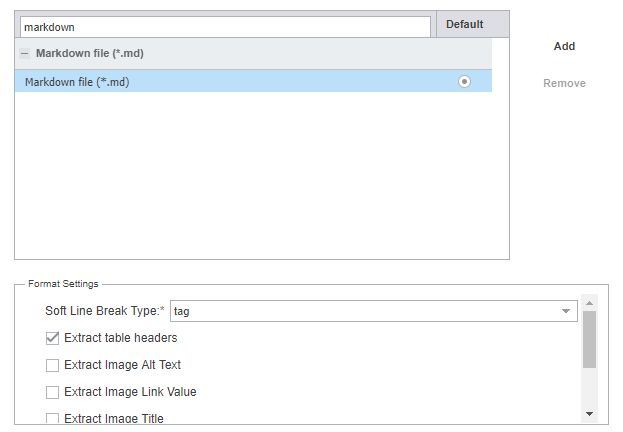

Wordfast Pro 8
===

# How to open Markdown settings in Wordfast

1. Go to `Preferences`
	- Note: Unlike in [Phrase](phrase-01-settings) or [Trados](trados-01-settings), you do not have to create a new project to configure Markdown settings.
2. Go to `New Project Preferences>Filters`.
3. In the `Available filters` list, scroll down to `Markdown file` or type `Markdown` in the search field.
4. Click the `Markdown file` button to open the Markdown settings as seen in the image below.

*Figure 1: Default Markdown filters in Wordfast Pro 8*

# Markdown settings

Wordfast Pro 8 has the following filter settings for Markdown:
1. `Soft Line Break Type:``
	1. `tag`
	2. `break`
	3. `none`
2. `Extract table headers`
3. `Extract image alt text`
4. `Extract image link value`
5. `Extract image title`
6. `Extract href URL title`

Default settings:
1. `Soft line break type — tag`
2. `Extract table headers`

The default settings were used as the basic settings in the study. Then, further settings were added in the order from top to bottom.

In the `Soft Line Break Type` setting, only the `tag` setting was used in the study. The `break` and `none` settings affected only segmentation rules. As a result, they were omitted in the study.

The behaviour of the settings is described in the [Wordfast — Results](wordfast-02-results) section.

---

Go to section: [*Wordfast — Results*](wordfast-02-results)