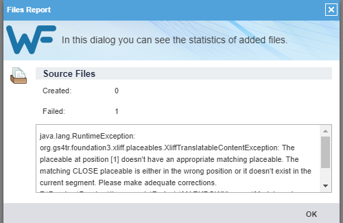

Wordfast Pro 8 
===

# Wordfast results

<!-- REUSE COMP BGN -->
The results for individual settings are grouped according to the sections in the test file. If a feature is not mentioned, it means it works as intended — it was imported correctly into the editor and produced the correct output in the exported file.

The test was carried out by checking the boxes in the settings. This made the CAT import more features and allowed more editing. When a feature starts working, it is noted in the relevant section.

The links in the headers lead to the files translated with the given settings.

{: .important }
Not every Markdown formatting, e.g., `^superscript^`, works in GitHub preview. The fact that a feature does not work in GitHub preview does not mean it is caused by the incorrect output from the CAT. Various flavours ("dialects") of Markdown render more sophisticated syntax differently on different platforms.

{: .note }
The meanings of several phrases used in this section can be found in [Definitions](ref-test-file#definitions).
The reference information on what should or should not be translated (e.g. inline code) can be found in the section [*Why is Markdown difficult for CATs?*](ref-why-md-difficult).
<!-- REUSE COMP END -->

Table of contents:

- [General results](#general-results)
- [Default format settings with extract table headers{:target="\_blank"}](#default-format-settings-with-extract-table-headerstarget_blank)
- [Extract image alt text{:target="\_blank"}](#extract-image-alt-texttarget_blank)
- [Extract image link value{:target="\_blank"}](#extract-image-link-valuetarget_blank)
- [Extract image title{:target="\_blank"}](#extract-image-titletarget_blank)
- [Extract href link URL value{:target="\_blank"}](#extract-href-link-url-valuetarget_blank)
- [Extract href link URL title{:target="\_blank"}](#extract-href-link-url-titletarget_blank)

# General results

The first obstacle was that Wordfast could not import the test file:



*Figure 1: Error message when importing the test file*

After trial and error, it was discovered that the following lines were causing the error:
```
202 | - this **simply ~~*wrong*~~**
...
205 | 1. ~~this is *__bold__ but folly*, so I crossed it out~~
```

Interestingly, the error did not appear when the lines were turned into inline code.

It was difficult to establish what exactly caused the error. It is assumed that bold and italics next to each other within or outside strikethrough may cause it.

Different combinations of bold, italics, and strikethrough are covered in the [Wordfast Pro table error file](resources/WF-error){:target="_blank"}.

To continue the test, the two lines were changed into inline code and a slightly changed [test file](resources/Markdown-in-CAT-test-Wordfast-Pro)  was used.

Once opened, Markdown formatting is displayed as CAT tags:


*Figure 2: Markdown formatting displayed as CAT tags in the Wordfast editor*

<kbd>&#128008;CAT EDITOR ISSUE</kbd>: Wordfast has difficulties with complex Markdown syntax. There are cases in which tags are shown as text, i.e. asterisks or underscore signs. This happens, for example, when they are combined together, they are between characters other than spaces, or they are in a table; see Figure 3.


*Figure 3: Markdown tags shown as CAT tags in segments 243 and 244 and as text in segment 245*

However, this does not affect the output file. The characters are correctly processed as Markdown tags.

The Wordfast editor has its own tools for adding simple formatting like bold or italics. However, they do not work in the segment editor. To add new text formatting, it must be entered with Markdown syntax. It is then shown correctly in the output file.

Other general remarks on Wordfast Pro:
- it does not interpret extended syntax, like subscript, superscript, or footnote — they are ignored and shown as text
- formatting (even standard Markdown formatting) in unrolled section is shown as text — this is most likely caused by embedding tags within HTML tags
- inline code is always ignored: `this is not translatable!`

The links in the headers lead to output files — the files translated with given settings.

# [Default format settings with extract table headers](./resources/Markdown-in-CAT-test-WF_PL-01){:target="_blank"}

## Basic syntax

Basic syntax works as intended.

## Links

Reference is not fully translatable: the display text in square brackets is translatable, but the reference content in round brackets is not translatable as in `[Składnia podstawowa](#basic-syntax)`.

Image alt text in a displayed image is ignored.

Hover text is ignored.

The rest works as intended.

## Quotations

Inline code is ignored.

Block code is ignored.

Block code with JavaScript comment is ignored.

The rest works as intended.

## Extended syntax

<kbd>&#128008;CAT EDITOR ISSUE</kbd>: Some content in the table was deleted. As a result, it did not appear in the output file.

Emoji is shown as CAT tags.

Subscript is shown as text.

Superscript is shown as text.

Footnotes are shown as text.

Comments to be omitted are ignored.

The rest works as intended.

## HTML and other tags

<kbd>&#128228;OUPUT FILE ISSUE</kbd>: The Markdown table in the collapsed section does not work.

<kbd>&#128680;REALLY!</kbd>: However, other Markdown formatting works in the collapsed section.

<kbd>&#128680;REALLY!</kbd>: Text between `<code></code>` HTML tags can be translated. It was expected that it would be ignored just like inline code or code block.

The rest, including the text in the embedded HTML, works as intended.

# [Extract image alt text](./resources/Markdown-in-CAT-test-WF_PL-02){:target="_blank"}

## Basic syntax

Basic syntax works as intended.

## Links

Image alt text is now translatable, but not the hover text:

``

The rest works as intended or as above.

## Quotations

Quotations work as intended or as above.

## Extended syntax

Extended syntax works as intended or as above. This means that some content in the table was again deleted. As a result, it did not appear in the output file.

## HTML and other tags

HTML and other tags work as intended or as above.

# [Extract image link value](./resources/Markdown-in-CAT-test-WF_PL-03){:target="_blank"}

## Basic syntax

Basic syntax works as intended.

## Links

Image link values are now imported:


*Figure 4: Image link value imported*

The rest works as intended or as above.

## Quotations

Quotations work as intended or as above.

## Extended syntax

Extended syntax works as intended or as above. This means that some content in the table was again deleted. As a result, it did not appear in the output file.

## HTML and other tags

HTML and other tags work as intended or as above.

# [Extract image title](./resources/Markdown-in-CAT-test-WF_PL-04){:target="_blank"}

## Basic syntax

Basic syntax works as intended.

## Links

Hover text is imported, but only for images:

```
1. Odniesienie do rozdziału [**Pogrubienie** z tekstem podpisu znajduje się tutaj](#bold "Bolder").

2. Odniesienie do wyświetlanego pliku graficznego w repozytorium z wyświetlanym tekstem podpisu znajduje się tutaj:


3. Odniesienie do [mojej strony Translatorion.com znajduje się tutaj](https://translatorion.com/ "I didn't choose translator's life, translator's life chose me").
```

The rest works as intended or as above.

## Quotations

Quotations work as intended or as above.

## Extended syntax

Extended syntax works as intended or as above. This means that some content in the table was again deleted. As a result, it did not appear in the output file.

## HTML and other tags

HTML and other tags work as intended or as above.

# [Extract href link URL value](./resources/Markdown-in-CAT-test-WF_PL-05){:target="_blank"}

## Basic syntax

Basic syntax works as intended.

## Links

<kbd>&#128008;CAT EDITOR ISSUE</kbd>: Markdown and HTML reference links are shown partially as text and as text, respectively. In the case of Markdown, brackets are ignored, but the hash symbol is visible in the Wordfast editor.

This means it is possible to translate e.g. the table of contents:


*Figure 5: Markdown reference syntax shown partially as text*

The rest works as intended or as above.

## Quotations

Quotations work as intended or as above.

## Extended syntax

<kbd>&#128680;REALLY!</kbd>: For some reason, the missing content in the table cells appeared.

The rest works as intended or as above.

## HTML and other tags

HTML and other tags work as intended or as above.

# [Extract href link URL title](./resources/Markdown-in-CAT-test-WF_PL-06){:target="_blank"}

## Basic syntax

Basic syntax works as intended.

## Links

Hover text for Markdown reference and HTML links is imported and can be translated:

```
1. Odniesienie do rozdziału [**Pogrubienie** z tekstem podpisu znajduje się tutaj](#pogrubienie "Bardziej pogrubione").

2. Odniesienie do wyświetlanego pliku graficznego w repozytorium z wyświetlanym tekstem podpisu znajduje się tutaj:


3. Odniesienie do [mojej strony Translatorion.com znajduje się tutaj](https://translatorion.com/ "Nie wybrałem życia tłumacza, życie tłumacza wybrało mnie").
```

## Quotations

Quotations work as intended or as above.

## Extended syntax

Extended syntax works as intended or as above.

## HTML and other tags

HTML and other tags work as intended or as above.

---

Next section: [*Wordfast Pro 8 — summary and recommendations*](wordfast-03-summary-and-recommendations)